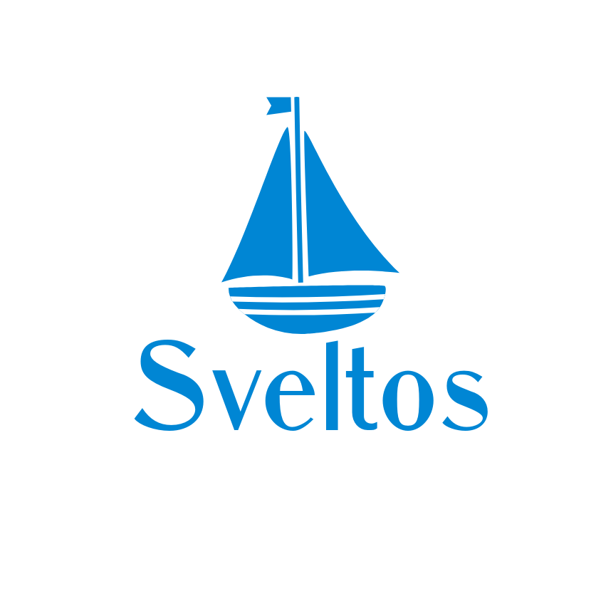
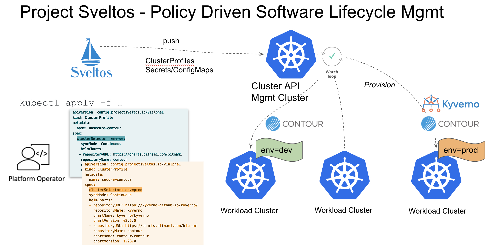

[](https://github.com/projectsveltos/sveltos-manager/actions)
[](https://goreportcard.com/report/github.com/projectsveltos/sveltos-manager)
[](http://projectsveltos.slack.com/)
[](LICENSE)

# Sveltos



Sveltos is a policy driven approach to manage kubernetes resources and helm charts in ClusterAPI clusters. Sveltos provides declarative APIs to provision  features like Helm charts, ingress controllers, CNIs, storage classes and other resources in a given set of Kubernetes clusters. Sveltos is a freely available and open source. Sveltos is very lightweight and can be installed onto any Kubernetes clusters in minutes. Sveltos is powered by [ClusterAPI](https://github.com/kubernetes-sigs/cluster-api).

## How it works
The project follows the Kubernetes [Operator pattern](https://kubernetes.io/docs/concepts/extend-kubernetes/operator/) and it uses [Controllers](https://kubernetes.io/docs/concepts/architecture/controller/) which provides a reconcile function responsible for synchronizing resources until the desired state is reached on the cluster. 

The project requires [ClusterAPI](https://github.com/kubernetes-sigs/cluster-api) to be installed in such cluster. 

[ClusterAPI](https://github.com/kubernetes-sigs/cluster-api) is a Kubernetes sub-project focused on providing declarative APIs and tooling to simplify provisioning, upgrading, and operating multiple Kubernetes clusters.

## Description 


The idea is simple:
1. from the management cluster, selects one or more `clusters` with a Kubernetes [label selector](https://kubernetes.io/docs/concepts/overview/working-with-objects/labels/#label-selectors);
2. lists which `features` need to be deployed on such clusters.

where term:
1. `clusters` represents [CAPI cluster](https://github.com/kubernetes-sigs/cluster-api/blob/main/api/v1beta1/cluster_types.go);
2. `features` represents either an [helm release](https://helm.sh) or a Kubernetes resource.

Here is an example of how to require that any CAPI Cluster with label *env: prod* has following features deployed:
1. Kyverno helm chart (version v2.5.0)
2. kubernetes resource(s) contained in the referenced Secret: *default/storage-class*
3. kubernetes resource(s) contained in the referenced ConfigMap: *default/contour*.

```
apiVersion: config.projectsveltos.io/v1alpha1
kind: ClusterProfile
metadata:
  name: demo
spec:
  clusterSelector: env=prod
  syncMode: Continuous
  helmCharts:
  - repositoryURL: https://kyverno.github.io/kyverno/
    repositoryName: kyverno
    chartName: kyverno/kyverno
    chartVersion: v2.5.0
    releaseName: kyverno-latest
    releaseNamespace: kyverno
    helmChartAction: Install
 policyRefs:
  - name: storage-class
    namespace: default
    kind: Secret
  - name: contour-gateway
    namespace: default
    kind: ConfigMap
```

As soon as a CAPI cluster is a match for above ClusterProfile instance, all referenced features are automatically deployed in such cluster.

## Sveltos in action


To see the full demo, have a look at this [youtube video](https://youtu.be/Ai5Mr9haWKM)

## Features List
1. Flexible cluster selection (see [video](https://youtu.be/Ai5Mr9haWKM))
2. Sync Modes: OneTime, Continuous or DryRun  (see [video](https://youtu.be/gfWN_QJAL6k))
3. Snapshotting (see [video](https://youtu.be/ALcp1_Nj9r4))
4. Rollback (see [video](https://youtu.be/sTo6RcWP1BQ))
5. Conflict detection
6. Declaritive API and CLI

## Getting Started
If you want to test it out, just execute, `make create-cluster` and it will:
1. create a [KIND](https://sigs.k8s.io/kind) cluster;
2. install ClusterAPI;
3. create a CAPI Cluster with Docker as infrastructure provider;
4. install CRD and the Deployment from this project;
5. create a ClusterProfile instance;
6. modify CAPI Cluster labels so to match ClusterProfile selector.

# Understanding how to configure and use the project

## ClusterSelector
The clusterSelector field is a Kubernetes [label selector](https://kubernetes.io/docs/concepts/overview/working-with-objects/labels/#resources-that-support-set-based-requirements) that matches against labels on CAPI clusters.

## SyncMode 

SyncMode has three possible options: `Continuous`, `OneTime` and `DryRun`.

### OneTime
OneTime means that when a CAPI Cluster matches a ClusterProfile instance, all the ClusterProfile's helm charts and Kubernetes resources at that point in time will be installed into the CAPI Cluster.
Any change to ClusterProfile (for instance adding one more helm chart or referencing a new ConfigMap/Secret) will not be deployed into the already matching CAPI Clusters.

### Continuous
Continuous means that any change to ClusterProfiles (referencing a new helm chart or a new ConfigMap) will be immediately reconciled into the matching CAPI Clusters.
Reconciled can mean three things: 
1. deploy (when CAPI Cluster matches a ClusterProfile) 
2. update (when ClusterProfile configuration changes and/or any of the referenced ConfigMap/Secret changes);
3. withdraw (when ClusterProfile stops listing an helm release and/or referencing to a ConfigMap/Secret or any of the referenced ConfigMap/Secret is deleted).

Let's take an example. 
ClusterProfile is referencing, in the policyRefs section, following ConfigMap containing a Kyverno policy preventing any ServiceAccount (except cluster-admin) to create/delete a Gateway instance.

```
apiVersion: v1
kind: ConfigMap
metadata:
  name: kyverno-disallow-gateway
  namespace: default
data:
  kyverno.yaml: |
    apiVersion: kyverno.io/v1
    kind: ClusterPolicy
    metadata:
      name: no-gateway
      annotations:
        policies.kyverno.io/title: Block Create,Update,Delete of Gateway instances
        policies.kyverno.io/severity: medium
        policies.kyverno.io/subject: Gateway
        policies.kyverno.io/description: >-
          Management cluster admin controls Gateway's configurations.
    spec:
      validationFailureAction: enforce
      background: false
      rules:
      - name: block-gateway-updates
        match:
          any:
          - resources:
              kinds:
              - Gateway
        exclude:
          any:
          - clusterRoles:
            - cluster-admin
        validate:
          message: "Gateway's configurations is managed by management cluster admin."
          deny:
            conditions:
              - key: "{{request.operation}}"
                operator: In
                value:
                - CREATE
                - DELETE
```

Because ClusterProfile is referencing above ConfigMap, such Kyverno ClusterPolicy *no-gateway* will be deployed in any matching CAPI Clusters.
Because the ClusterProfile syncMode is set to Continuous, any modifications to:
1. ClusterProfiles;
2. the content of the referenced ConfigMaps/Secret 
will result in an update in any of the matching CAPI Clusters.

For instance, continuing with above example, if we modify the content of the ConfigMap by changing the validate part to (note we are adding UPDATE on top of CREATE/DELETE):

```
apiVersion: v1
kind: ConfigMap
metadata:
  name: kyverno-disallow-gateway
  namespace: default
  ...
        validate:
          message: "Gateway's configurations is managed by management cluster admin."
          deny:
            conditions:
              - key: "{{request.operation}}"
                operator: In
                value:
                - CREATE
                - DELETE
                - UPDATE
```

the Kyverno policy  *no-gateway* in each matching CAPI clusters will be update accordingly.

If we modify the ClusterProfile to not reference this policy anymore:

```
apiVersion: config.projectsveltos.io/v1alpha1
kind: ClusterProfile
metadata:
  name: demo
spec:
  ...
  policyRefs:
  - name: storage-class
    namespace: default
```

that will cause the Kyverno ClusterPolicy *no-gateway* to be withdrawn from any matching CAPI cluster.

### DryRun
In a dry-run execution, you can execute a workflow so that the entire flow of the execution (all the operations that are executed in an actual run) is shown, but no actual code is executed and there are no side effects. 

Some applies here. Sometimes it is useful to see what will happen if a ClusterProfile is added/modified/deleted. So potential changes in matching CAPI clusters can be seen, validated and only then eventually applied.

A ClusterProfile in DryRun mode will make no changes to matching clusters. It will though generate a report indicating, per CAPI Cluster, what those changes would be. 

There is a CRD for that, called *ClusterReport*.
But using [sveltosctl](https://github.com/projectsveltos/sveltosctl) is much easier to see what those changes would be.

```
./bin/sveltosctl show dryrun
+-------------------------------------+--------------------------+-----------+----------------+-----------+--------------------------------+------------------+
|               CLUSTER               |      RESOURCE TYPE       | NAMESPACE |      NAME      |  ACTION   |            MESSAGE             | CLUSTER FEATURES |
+-------------------------------------+--------------------------+-----------+----------------+-----------+--------------------------------+------------------+
| default/sveltos-management-workload | helm release             | kyverno   | kyverno-latest | Install   |                                | dryrun           |
| default/sveltos-management-workload | helm release             | nginx     | nginx-latest   | Install   |                                | dryrun           |
| default/sveltos-management-workload | :Pod                     | default   | nginx          | No Action | Object already deployed.       | dryrun           |
|                                     |                          |           |                |           | And policy referenced by       |                  |
|                                     |                          |           |                |           | ClusterProfile has not changed |                  |
|                                     |                          |           |                |           | since last deployment.         |                  |
| default/sveltos-management-workload | kyverno.io:ClusterPolicy |           | no-gateway     | Create    |                                | dryrun           |
+-------------------------------------+--------------------------+-----------+----------------+-----------+--------------------------------+------------------+
```

To see DryRun mode in action, have a look at this [video](https://youtu.be/gfWN_QJAL6k)

## Secrets and ConfigMaps
When, for instance, we want to deploy a `StorageClass` in a subset of CAPI Clusters, we create a `ClusterProfile` instance, with an appropriate cluster selector and then we need to have this ClusterProfile reference the kubernetes resource we want to deploy in each matching cluster.

In this example, we need the StorageClass instance deployed in matching CAPI cluster. We don't need such resource in the management cluster. So where do we put the StorageClass instance in the management class so that ClusterProfile can reference it? We use `Secrets` and `ConfigMaps`.

Both *Secrets* and *ConfigMaps* data fields can be a list of key-value pairs. Any key is acceptable, and as value, there can be multiple objects in yaml or json format.

Secrets are preferred if the data includes sensitive information.

ClusterProfile can reference a ConfigMap and/or Secret, and the ConfigMap/Secret contains the Kubernetes resources we want to deploy in matching CAPI Clusters.

ClusterProfile's PolicyRefs section, is then a list of ConfigMaps/Secrets (identified by name and namespace and kind).

For instance by referecing following *contour-gateway* ConfigMap, a GatewayClass and Gateway instance will be automatically deployed in each matching CAPI clusters.

```
apiVersion: v1
kind: ConfigMap
metadata:
  name: contour-gateway
  namespace: default
data:
  gatewayclass.yaml: |
    kind: GatewayClass
    apiVersion: gateway.networking.k8s.io/v1beta1
    metadata:
      name: contour
    spec:
      controllerName: projectcontour.io/projectcontour/contour
  gateway.yaml: |
    kind: Namespace
    apiVersion: v1
    metadata:
      name: projectcontour
    ---
    kind: Gateway
    apiVersion: gateway.networking.k8s.io/v1beta1
    metadata:
     name: contour
     namespace: projectcontour
    spec:
      gatewayClassName: contour
      listeners:
        - name: http
          protocol: HTTP
          port: 80
          allowedRoutes:
            namespaces:
              from: All
```

## Helm charts
HelmCharts section in above CRD instance, is a list of Helm charts we want to deploy in each CAPI  matching clusters.

[Helm](https://helm.sh) is a CNCF graduated project that serves as a package manager widely used in the community. This project uses [Helm golang SDK](helm.sh/helm/v3/pkg) to deploy all helm charts listed in above ClusterProfile instance.


### List helm charts and resources deployed in a CAPI Cluster.

There is many-to-many mapping between Clusters and ClusterProfile: 
- Multiple ClusterProfiles can match with a CAPI cluster; 
- Multiple CAPI clusters can match with a single ClusterProfile.

As for DryRun, [sveltosctl](https://github.com/projectsveltos/sveltosctl) can be used to properly list all deployed features per CAPI cluster:

```
./bin/sveltosctl show features
+-------------------------------------+--------------------------+-----------+----------------+---------+-------------------------------+------------------+
|               CLUSTER               |      RESOURCE TYPE       | NAMESPACE |      NAME      | VERSION |             TIME              | CLUSTER PROFILES |
+-------------------------------------+--------------------------+-----------+----------------+---------+-------------------------------+------------------+
| default/sveltos-management-workload | helm chart               | kyverno   | kyverno-latest | v2.5.0  | 2022-10-11 20:59:18 -0700 PDT | mgianluc         |
| default/sveltos-management-workload | helm chart               | nginx     | nginx-latest   | 0.14.0  | 2022-10-11 20:59:25 -0700 PDT | mgianluc         |
| default/sveltos-management-workload | helm chart               | mysql     | mysql          | 9.3.3   | 2022-10-11 20:43:41 -0700 PDT | mgianluc         |
| default/sveltos-management-workload | :Pod                     | default   | nginx          | N/A     | 2022-10-12 09:33:25 -0700 PDT | mgianluc         |
| default/sveltos-management-workload | kyverno.io:ClusterPolicy |           | no-gateway     | N/A     | 2022-10-12 09:33:25 -0700 PDT | mgianluc         |
+-------------------------------------+--------------------------+-----------+----------------+---------+-------------------------------+------------------+
```

Otherwise, a new CRD is introduced to easily summarize which features (either helm charts or kubernetes resources) are deployed in a given CAPI cluster because of one or more ClusterProfiles.
Such CRD is called *ClusterConfiguration*.

There is exactly only one ClusterConfiguration for each CAPI Cluster.

Following example shows us that because of ClusterProfile *demo* three helm charts and one Kyverno ClusterPolicy were deployed.


```
apiVersion: v1
items:
- apiVersion: config.projectsveltos.io/v1alpha1
  kind: ClusterConfiguration
  metadata:
    creationTimestamp: "2022-09-19T21:14:15Z"
    generation: 1
    name: sveltos-management-workload
    namespace: default
    ownerReferences:
    - apiVersion: config.projectsveltos.io/v1alpha1
      kind: ClusterProfile
      name: demo2
      uid: f0f93440-95ae-4663-aff7-3b27c1135dfc
    resourceVersion: "45488"
    uid: efa326cb-a7e0-401c-918f-0a9252033856
  status:
    clusterProfileResources:
    - Features:
      - charts:
        - appVersion: v1.7.0
          chartName: kyverno-latest
          chartVersion: v2.5.0
          lastAppliedTime: "2022-09-19T21:14:16Z"
          namespace: kyverno
          repoURL: https://kyverno.github.io/kyverno/
        - appVersion: 2.3.0
          chartName: nginx-latest
          chartVersion: 0.14.0
          lastAppliedTime: "2022-09-19T21:14:23Z"
          namespace: nginx
          repoURL: https://helm.nginx.com/stable
        - appVersion: 1.22.1
          chartName: contour
          chartVersion: 9.1.2
          lastAppliedTime: "2022-09-19T21:17:31Z"
          namespace: projectcontour
          repoURL: https://charts.bitnami.com/bitnami
        featureID: Helm
      - featureID: Resources
        resources:
        - group: kyverno.io
          kind: ClusterPolicy
          lastAppliedTime: "2022-09-19T21:20:18Z"
          name: no-gateway
          owner:
            kind: ConfigMap
            name: kyverno-disallow-gateway
            namespace: default
      clusterProfileName: demo
```


## Detecting conflicts
Multiple ClusterProfiles can match same CAPI cluster. Because of that misconfiguration can happen and need to be detected.

For instance:
1. ClusterProfile A references ConfigMap A containing a Kyverno ClusterPolicy called *no-gateway"
2. ClusterProfile B references ConfigMap B containing a Kyverno ClusterPolicy called *no-gateway"

In such case, ClusterProfile A will be allowed to deploy the Kyverno ClusterPolicy, while ClusterProfile B will report a conflict.

Please note that in following example there is no conflict since both ClusterProfiles are referencing same ConfigMap:
1. ClusterProfile A references ConfigMap A containing a Kyverno ClusterPolicy called *no-gateway"
2. ClusterProfile B references ConfigMap A containing a Kyverno ClusterPolicy called *no-gateway"

Another example of misconfiguration is when two different ClusterProfiles match same CAPI Cluster(s) and both want to deploy same Helm chart in the same namespace.

In such a case, only one ClusterProfile will be elected and given permission to manage a specific helm release in a given CAPI cluster. Other ClusterProfiles will report such misconfiguration.

## Getting started on any Kubernetes cluster
You can use [KIND](https://sigs.k8s.io/kind) to get a local cluster for testing, or run against a remote cluster.

First you need to install ClusterAPI in such cluster. [ClusterAPI instruction](https://cluster-api.sigs.k8s.io/user/quick-start.html) can be followed.

Second you need to install the CRD and Deployment for the project in the management cluster:

### Deploy YAML
You can post the YAML to the management cluster

```
kubectl create -f  https://raw.githubusercontent.com/projectsveltos/cluster-api-feature-manager/master/manifest/manifest.yaml
```

### Uninstall CRDs
To delete the CRDs from the cluster:

```sh
make uninstall
```

### Undeploy controller
UnDeploy the controller to the cluster:

```sh
make undeploy
```

## Compatibility with Cluster API and Kubernetes Versions

Sveltos is compatible with the following versions of Cluster API:

|  | Cluster API `v1beta1` (`v1.0.x`) | Cluster API `v1beta1` (`v1.1.x`)  | Cluster API `v1beta1` (`v1.2.x`) |
|---|---|---|---|
|Sveltos `v0.1.0` | ✓ | ✓ | ✓ |

This controller version can install and manage the following versions of Kubernetes:

|  | Sveltos `v0.1.0` |
|---|---|
| Kubernetes 1.23.x | ✓ |
| Kubernetes 1.24.x | ✓ |
| Kubernetes 1.25.x | ✓ |

Test status:

* `✓` tested

## Contributing [](https://github.com/projectsveltos/sveltos-manager/issues)
If you have questions, noticed any bug or want to get the latest project news, you can connect with us in the following ways:
1. Open a bug/feature enhancement on github;
2. Chat with us on the Slack in the [#projectsveltos](http://projectsveltos.slack.com/) channel

## License

Copyright 2022.

Licensed under the Apache License, Version 2.0 (the "License");
you may not use this file except in compliance with the License.
You may obtain a copy of the License at

    http://www.apache.org/licenses/LICENSE-2.0

Unless required by applicable law or agreed to in writing, software
distributed under the License is distributed on an "AS IS" BASIS,
WITHOUT WARRANTIES OR CONDITIONS OF ANY KIND, either express or implied.
See the License for the specific language governing permissions and
limitations under the License.
